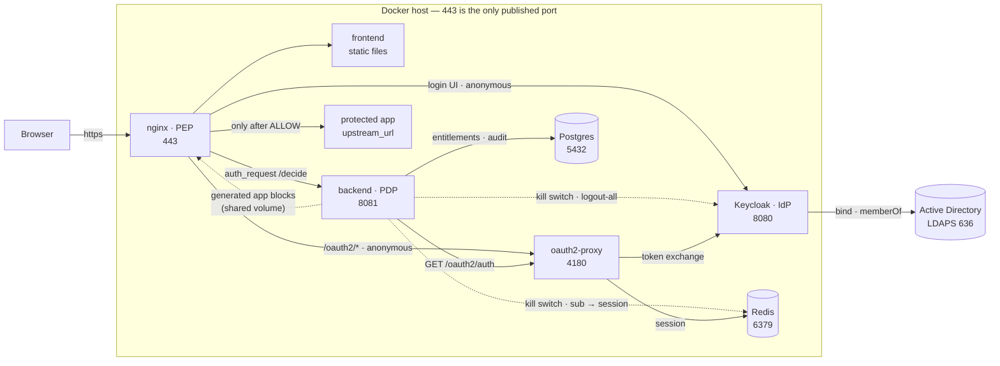

# OpenBerat

*Türkçe: [README_TR.md](README_TR.md)*

An **Identity-Aware Proxy (IAP)** that uses Keycloak as its identity provider,
federates to Active Directory, and derives the applications a user may reach
from their AD group membership. ZTNA is the wider umbrella term that contains
IAP.

The user signs in once, sees only the applications they are entitled to in a
portal, and reaches them without a VPN. Every request is re-authorised against
the identity.

A *berat* was an Ottoman warrant: the document granting a person an office or a
right. Authentication is delegated to Keycloak and oauth2-proxy — the only thing
this codebase decides is what you are permitted to reach
([ADR-0012](docs/adr/0012-project-name-openberat.md)).

**Status:** the code is written and runs. Phases 0–6 in [TODO.md](TODO.md) are
closed: the chain from login to a protected application works end to end on a
lab against a real AD, and N-01 to N-03 are measured rather than estimated
([docs/07](docs/07-references.md)). **No version is tagged yet** — `release.sh`
builds the offline bundle, but cutting the tag stays a deliberate manual act
([ADR-0023](docs/adr/0023-versioning-and-release.md)). Phase 6 leaves one box
open — running the backend on more than one instance, which N-06 puts outside
v1 — and Phase 7 is what reading the finished code found. The first of it is
done: v1 now ships one read-only admin screen, the audit record and `explain`
([ADR-0026](docs/adr/0026-audit-explain-screen-in-v1.md)), written without a
framework ([ADR-0027](docs/adr/0027-frontend-no-framework.md)).

**Licence:** [GPL-3.0-or-later](LICENSE). Free to install and run in your own
environment; there is no paid edition. Patches welcome under
[DCO](CONTRIBUTING.md) — no CLA to sign.

## What you need before installing

`docker compose up` brings the stack up on one machine (N-05), but the stack is
not the whole job. These are the operator's, and none of them can be skipped:

| Prerequisite | Why |
|---|---|
| **A common parent domain** for every protected application, set as `APPS_DOMAIN` | The session cookie is shared across them; applications on unrelated domains are not supported ([ADR-0015](docs/adr/0015-single-parent-domain.md)). One variable names it and everything else reads it — the portal is `portal.$APPS_DOMAIN`, Keycloak `auth.$APPS_DOMAIN` |
| **A wildcard DNS record** and a **wildcard TLS certificate** covering it | An admin can add an application but cannot create name resolution ([ADR-0011](docs/adr/0011-nginx-config-generation.md)). When the certificate lapses, everything goes down at once |
| **TLS terminating at nginx**, including behind a load balancer | The certificate, the `Secure` cookie and the issuer URL Keycloak builds are all downstream of it. A balancer that terminates TLS and speaks plain HTTP to the stack finds a redirect loop on :80 and a refused connection on :443 ([INSTALL.md](INSTALL.md) §1) |
| **Write access to Active Directory** for the `OpenBerat-` groups | Entitlements are AD groups. Somebody has to create them ([ADR-0008](docs/adr/0008-group-identity-name.md)) |
| **An AD service account** for Keycloak's LDAP bind, read-only | How to create it and what to point at it: [INSTALL.md](INSTALL.md) §4; the settings themselves: [docs/03-keycloak-ad.md](docs/03-keycloak-ad.md) |
| **One AD group for administrators**, named in `ADMIN_GROUP` | In a fail-closed system the first admin cannot come from the database — and the name has to pass the group filter below, or nobody reaches `/api/admin/*` at all ([docs/07](docs/07-references.md)) |
| **A group filter on Keycloak's LDAP group mapper** matching the `OpenBerat-` prefix | Not tidiness: names reach the backend comma-joined, so a group *named* `Payroll,OpenBerat-Admins` arrives as two and the second is `ADMIN_GROUP`. The filter is what keeps such a name out of the claim ([ADR-0008](docs/adr/0008-group-identity-name.md), [docs/07](docs/07-references.md)) |
| **`NO_CACHE` on Keycloak's LDAP provider** | Measured: at `DEFAULT` a group removed in AD survives a brand-new login, and nothing bounds the delay. The system keeps working and stops tracking AD ([ADR-0006](docs/adr/0006-group-membership-source.md), [docs/07](docs/07-references.md)) |

Realistically this asks for an operator who is comfortable with AD, Keycloak and
nginx. It replaces a VPN; it is not lighter than one to set up, only lighter to
live with. [INSTALL.md](INSTALL.md) is complete for v1, and every step in it has
been run on the lab rather than reasoned about.

## Running it

Four steps, and [INSTALL.md](INSTALL.md) is the same four with everything that
can go wrong in each:

```sh
mkdir certs            # a wildcard certificate covering *.$APPS_DOMAIN     §1
cp .env.example .env   # APPS_DOMAIN, the passwords, two client secrets     §3
docker compose build
docker compose up -d
```

`up` with no arguments starts the six services a release consists of; the lab
directory and the two sample applications sit behind `--profile lab` and stay
down unless asked for by name ([ADR-0023](docs/adr/0023-versioning-and-release.md)).
Nobody applies the database schema — the backend runs `backend/migrations/`
itself at startup and exits rather than serve against a schema it has not seen,
so a first install needs no `psql` and an upgrade is `docker compose up -d`.

Two things look like failures on a first boot and are not: oauth2-proxy
restarts until Keycloak answers OIDC discovery (~25 s), and a self-signed
certificate makes every browser warn. A **lab** needs one more step — Keycloak
holds no local users, so the AD fixture has to run before anyone can log in
([INSTALL.md](INSTALL.md) §5).

## How it works



**One decision per request.** nginx intercepts every HTTP request and asks the
backend; the backend asks oauth2-proxy who the user is, matches their AD groups
against the entitlement table, and answers 200, 401 or 403. Nothing reaches a
protected application before that answer — including CSS, scripts and icons.

1. Browser → `nginx:443`, which issues `auth_request /decide` to the backend
2. Backend forwards the session cookie to `oauth2-proxy:4180` to learn the identity
3. No session → 401 → nginx redirects to oauth2-proxy → Keycloak → LDAPS bind to AD
4. Session → the backend matches `X-Auth-Request-Groups` against the entitlements in Postgres
5. ALLOW → nginx proxies upstream with the `X-Auth-*` headers stripped and rewritten. DENY → 403 → the portal's "no access" page

An admin defines applications through the API rather than by editing
configuration: the backend renders an nginx `server` block per application into
a volume nginx shares, nginx tests it and reloads itself, and a block it refuses
is rolled back with the previous configuration left serving
([ADR-0011](docs/adr/0011-nginx-config-generation.md)).

The full sequence, the failure modes and the decision cache are in
[docs/02-architecture.md](docs/02-architecture.md).

### Ports

| Component | Port | Published? |
|---|---|---|
| nginx | 443 | **Yes — the only one.** 80 is *not* published, so `http://` is refused rather than redirected; the redirect block is in the image for an operator who chooses to publish it |
| backend | 8081 | No |
| oauth2-proxy | 4180 | No |
| Keycloak | 8080 | No — reached through nginx at `auth.apps.<domain>` |
| Postgres | 5432 | No |
| Redis | 6379 | No |
| Active Directory | 636 (LDAPS) | External, outbound only |

Every container except nginx publishes nothing, and the internal side is split
into **two networks**: protected applications sit on `edge` with nginx alone,
while the backend, oauth2-proxy, Keycloak, Postgres and Redis sit on `core` — so
a compromised application cannot reach the decision chain or the session store
directly. That isolation is not a deployment preference: an application behind
this proxy learns who the user is from the `X-Auth-*` headers
([ADR-0021](docs/adr/0021-application-identity-trusted-headers.md)), so a
reachable upstream port is not information disclosure but impersonation —
measured, `docs/07`. Publishing one is the single configuration mistake that
undoes the product. A signed identity JWT is the stronger answer and is still
open in [docs/06-requirements.md](docs/06-requirements.md).

Two hosts are deliberately **anonymous**, and both have to be: `/oauth2/*` and
Keycloak's login UI. Put either behind `auth_request` and you would have to be
authenticated in order to authenticate.

We write two components: the **backend** (authorisation decision, `/api`, audit)
and the **frontend** (the portal). Proxying is nginx, OIDC is oauth2-proxy,
identity is Keycloak — all three are off the shelf and configured, not written.

**Stack:** Rust (axum + sqlx) · Postgres · Redis · nginx · oauth2-proxy · Keycloak · Docker

## On a corporate network

Behind a load balancer, an existing AD and a firewall, four things are the
operator's, and getting one of them wrong is the way this is usually broken:

- **The domain is `APPS_DOMAIN`** — one variable in `.env`, read by both
  `server_name`s, oauth2-proxy's issuer, redirect, cookie and whitelist
  domains, the realm's redirect URI, and the backend's origin check. Two of
  those read it at build or import time, so changing it is `docker compose
  build nginx keycloak` rather than a restart. Unset, compose refuses to start
  anything.
- **TLS terminates at nginx.** A balancer passes 443 through or re-encrypts to
  it; one that terminates TLS and speaks plain HTTP finds :443 refusing
  plaintext and :80 unpublished. Whatever it does, three headers have to survive
  it — `Host`, `X-Forwarded-Proto: https`, and an `X-Forwarded-For` that is
  **replaced rather than appended**, because Keycloak reads the first entry as
  the client address ([INSTALL.md](INSTALL.md) §1).
- **Three firewall directions, and the third is the one that is missed.** In:
  443 only. Out: LDAPS 636 to a domain controller. And **users must not be able
  to reach a protected application directly** — with `X-Auth-*` a header *is*
  the authentication, so a reachable upstream port is impersonation and not
  information disclosure. Allow the proxy's address and nothing else, then test
  it with a forged header from a third machine ([INSTALL.md](INSTALL.md) §7).
- **The directory is yours.** Keycloak binds read-only over LDAPS; the
  `OpenBerat-` groups, `ADMIN_GROUP`, `NO_CACHE` and the group filter are all
  directory-side, and none of them is optional ([INSTALL.md](INSTALL.md) §4).

There is no health endpoint to hand the balancer: `/healthz` and `/readyz` sit
on the internal network and nginx proxies neither. Use a TCP check on 443, or
the portal itself — without a session it answers 302 towards Keycloak, which is
the whole chain answering rather than one process.

## What it does not do

- **No HA in v1.** One machine, one nginx, and a rehearsed break-glass instead
  of a second one ([ADR-0017](docs/adr/0017-fail-closed-availability.md)); N-06
  puts more than one instance outside v1.
- **An already-open WebSocket or SSE connection is outside revocation.** It is
  authorised once, at the upgrade, and never again — measured
  ([docs/07](docs/07-references.md)). HTTP requests are bounded: six minutes for
  an AD change, seconds for the kill switch
  ([ADR-0016](docs/adr/0016-n03-revocation-targets.md)). A long-lived connection
  is not ([INSTALL.md](INSTALL.md) §8).
- **No MFA yet, including for administrators.** Keycloak does it as realm
  configuration and no code here would change
  ([docs/03](docs/03-keycloak-ad.md)); it is decided in neither direction.
- **Keycloak still runs in dev mode** with the embedded database. Right for a
  lab, wrong for an install that has to survive a rebuild — the production form
  is an open item in [TODO.md](TODO.md).
- **Web only.** SSH and RDP would arrive as Guacamole behind the same proxy
  ([ADR-0001](docs/adr/0001-scope-v1-web-only.md)). No password vault, no device
  posture, no agents ([docs/06](docs/06-requirements.md)).

## Directories

| Directory | Contents |
|---|---|
| `backend/` | Rust: `/decide`, `/api`, the authorisation decision, audit |
| `frontend/` | Portal (buttons driven by AD `memberOf` entitlements). No build step, and no admin screens in v1 — administration is `/api/admin/*` ([INSTALL.md](INSTALL.md) §6). |
| `nginx/` | PEP configuration + static serving |
| `keycloak/` | Realm export (LDAP federation, group mapper) + our login theme |
| `samba-ad/` | Lab directory fixture — no Dockerfile, a stock image |
| `oauth2-proxy/` | Authentication configuration |

## Documentation

| File | Contents |
|---|---|
| [docs/00-glossary.md](docs/00-glossary.md) | Terminology — what ZTNA, IAP, PAM, JIT, SCIM and PDP/PEP mean |
| [docs/01-landscape.md](docs/01-landscape.md) | Existing solutions, and what we are not reinventing |
| [docs/02-architecture.md](docs/02-architecture.md) | Target architecture, components, flows, data model |
| [docs/03-keycloak-ad.md](docs/03-keycloak-ad.md) | Keycloak ↔ AD LDAP federation configuration |
| [docs/04-provisioning.md](docs/04-provisioning.md) | Provisioning, deprovisioning, JIT |
| [docs/05-authz-model.md](docs/05-authz-model.md) | The authorisation model and decision rules |
| [docs/06-requirements.md](docs/06-requirements.md) | Requirements and **open questions** |
| [docs/07-references.md](docs/07-references.md) | **Sources** — the basis for the technical claims, verified defaults |
| [docs/adr/](docs/adr/) | **Decisions taken** — 30 ADRs: scope, PEP, OIDC, language, name, licence, differentiator, revocation targets, application identity, audit retention, versioning, one read-only admin screen, no frontend framework, live sessions, what a path pattern means, break-glass from the same table |
| [SECURITY.md](SECURITY.md) | Reporting a vulnerability — channels, response times, scope, accepted limitations |
| [CONTRIBUTING.md](CONTRIBUTING.md) | How to contribute — DCO sign-off, conventions, what gets rejected |
| [LICENSE](LICENSE) | GPL-3.0-or-later |
| [TODO.md](TODO.md) | Roadmap |

## Where to start

1. [docs/00-glossary.md](docs/00-glossary.md) — get the concepts straight
2. [docs/01-landscape.md](docs/01-landscape.md) — decide whether this should be written at all
3. [docs/adr/](docs/adr/) — which decision was made, and why
4. [docs/06-requirements.md](docs/06-requirements.md) — answer the remaining open questions
