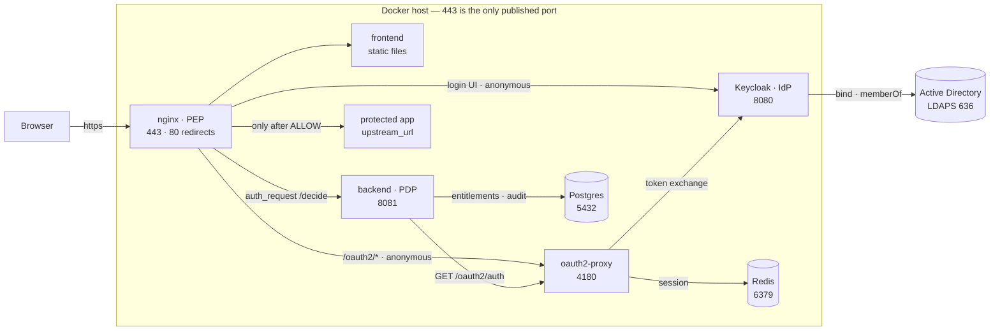

# OpenBerat

*Türkçe: [README_TR.md](README_TR.md)*

An **Identity-Aware Proxy (IAP)** that uses Keycloak as its identity provider,
federates to Active Directory, and derives the applications a user may reach
from their AD group membership. ZTNA is the wider umbrella term that contains
IAP.

The user signs in once, sees only the applications they are entitled to in a
portal, and reaches them without a VPN. Every request is re-authorised against
the identity.

A *berat* was an Ottoman warrant: the document granting a person an office or a
right. Authentication is delegated to Keycloak and oauth2-proxy — the only thing
this codebase decides is what you are permitted to reach
([ADR-0012](docs/adr/0012-project-name-openberat.md)).

**Status:** design complete, no code yet. Phase 0 is closed — every decision the
design could settle has an ADR. Next up: the Phase 1 lab in `TODO.md`.

**Licence:** [GPL-3.0-or-later](LICENSE). Free to install and run in your own
environment; there is no paid edition. Patches welcome under
[DCO](CONTRIBUTING.md) — no CLA to sign.

## How it works

**One decision per request.** nginx intercepts every HTTP request and asks the
backend; the backend asks oauth2-proxy who the user is, matches their AD groups
against the entitlement table, and answers 200, 401 or 403. Nothing reaches a
protected application before that answer — including CSS, scripts and icons.

1. Browser → `nginx:443`, which issues `auth_request /decide` to the backend
2. Backend forwards the session cookie to `oauth2-proxy:4180` to learn the identity
3. No session → 401 → nginx redirects to oauth2-proxy → Keycloak → LDAPS bind to AD
4. Session → the backend matches `X-Auth-Request-Groups` against the entitlements in Postgres
5. ALLOW → nginx proxies upstream with the `X-Auth-*` headers stripped and rewritten. DENY → 403 → the portal's "no access" page

The full sequence, the failure modes and the decision cache are in
[docs/02-architecture.md](docs/02-architecture.md).

### Ports

| Component | Port | Published? |
|---|---|---|
| nginx | 443 (80 redirects to it) | **Yes — the only one** |
| backend | 8081 | No |
| oauth2-proxy | 4180 | No |
| Keycloak | 8080 | No — reached through nginx |
| Postgres | 5432 | No |
| Redis | 6379 | No |
| Active Directory | 636 (LDAPS) | External, outbound only |

Every container except nginx publishes nothing and sits only on nginx's network.
That isolation is v1's answer to "can an upstream be reached bypassing the
proxy?" — the question is still open in
[docs/06-requirements.md](docs/06-requirements.md), where a signed identity JWT
is the stronger answer.

Two hosts are deliberately **anonymous**, and both have to be: `/oauth2/*` and
Keycloak's login UI. Put either behind `auth_request` and you would have to be
authenticated in order to authenticate.

We write two components: the **backend** (authorisation decision, `/api`, audit)
and the **frontend** (portal + admin). Proxying is nginx, OIDC is oauth2-proxy,
identity is Keycloak — all three are off the shelf and configured, not written.

**Stack:** Rust (axum + sqlx) · Postgres · Redis · nginx · oauth2-proxy · Keycloak · Docker

## Directories

| Directory | Contents |
|---|---|
| `backend/` | Rust: `/decide`, `/api`, the authorisation decision, audit |
| `frontend/` | Portal (buttons driven by AD `memberOf` entitlements) + admin. No build step. |
| `nginx/` | PEP configuration + static serving |
| `keycloak/` | Realm export (LDAP federation, group mapper) |
| `oauth2-proxy/` | Authentication configuration |

## Documentation

| File | Contents |
|---|---|
| [docs/00-glossary.md](docs/00-glossary.md) | Terminology — what ZTNA, IAP, PAM, JIT, SCIM and PDP/PEP mean |
| [docs/01-landscape.md](docs/01-landscape.md) | Existing solutions, and what we are not reinventing |
| [docs/02-architecture.md](docs/02-architecture.md) | Target architecture, components, flows, data model |
| [docs/03-keycloak-ad.md](docs/03-keycloak-ad.md) | Keycloak ↔ AD LDAP federation configuration |
| [docs/04-provisioning.md](docs/04-provisioning.md) | Provisioning, deprovisioning, JIT |
| [docs/05-authz-model.md](docs/05-authz-model.md) | The authorisation model and decision rules |
| [docs/06-requirements.md](docs/06-requirements.md) | Requirements and **open questions** |
| [docs/07-references.md](docs/07-references.md) | **Sources** — the basis for the technical claims, verified defaults |
| [docs/adr/](docs/adr/) | **Decisions taken** — 18 ADRs: scope, PEP, OIDC, language, name, licence, differentiator, revocation targets |
| [CONTRIBUTING.md](CONTRIBUTING.md) | How to contribute — DCO sign-off, conventions, what gets rejected |
| [LICENSE](LICENSE) | GPL-3.0-or-later |
| [TODO.md](TODO.md) | Roadmap |
| [CLAUDE.md](CLAUDE.md) | Code and documentation conventions |

## Where to start

1. [docs/00-glossary.md](docs/00-glossary.md) — get the concepts straight
2. [docs/01-landscape.md](docs/01-landscape.md) — decide whether this should be written at all
3. [docs/adr/](docs/adr/) — which decision was made, and why
4. [docs/06-requirements.md](docs/06-requirements.md) — answer the remaining open questions
