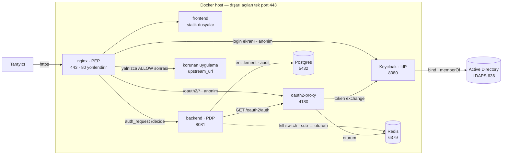

# OpenBerat

*English: [README.md](README.md)*

Keycloak'ı kimlik sağlayıcı olarak kullanan, Active Directory'ye federe olan,
kullanıcının AD grup üyeliklerine göre erişebileceği uygulamaları belirleyen
**Identity-Aware Proxy (IAP)** ürünü. ZTNA, IAP'ı içine alan daha geniş şemsiye terim.

Kullanıcı tek noktadan giriş yapar, bir portalda sadece yetkili olduğu uygulamaları
görür ve bunlara VPN olmadan erişir. Her istek kimlikle yeniden yetkilendirilir.

*Berat*, Osmanlı'da bir kişiye görev, imtiyaz veya hak veren belgedir. Kimlik
doğrulama Keycloak ve oauth2-proxy'ye devredildi — bu kod tabanının verdiği tek
karar neye erişebileceğin ([ADR-0012](docs/adr/0012-project-name-openberat.md)).

**Durum:** Tasarım tamam, kod yok. Faz 0 kapandı — tasarımın kendi başına
verebileceği her kararın bir ADR'si var. Sıradaki iş: `TODO.md` Faz 1 lab.

**Lisans:** [GPL-3.0-or-later](LICENSE). Kendi ortamına kurup bedava
kullanabilirsin; ücretli sürüm yok. Katkılar [DCO](CONTRIBUTING.md) ile alınır,
imzalanacak CLA yok.

> **Not:** Bu dosya dışındaki tüm dokümanlar İngilizce tutulur (`docs/`, `TODO.md`,
> alt dizin README'leri). Proje açık kaynak yayımlanacak.

## Kurmadan önce gerekenler

`docker compose up` yığını tek makinede ayağa kaldırır (N-05), ama iş yığından
ibaret değil. Aşağıdakiler operatörün sorumluluğunda ve hiçbiri atlanamaz:

| Ön koşul | Neden |
|---|---|
| Korunan tüm uygulamalar için **ortak bir üst alan adı** (`*.apps.<domain>`) | Oturum çerezi bunlar arasında paylaşılıyor; ilgisiz alan adlarındaki uygulamalar desteklenmiyor ([ADR-0015](docs/adr/0015-single-parent-domain.md)) |
| **Wildcard DNS kaydı** ve onu kapsayan **wildcard TLS sertifikası** | Admin uygulama ekleyebilir ama ad çözümlemesi yaratamaz ([ADR-0011](docs/adr/0011-nginx-config-generation.md)). Sertifika dolduğunda her şey aynı anda düşer |
| `OpenBerat-` gruplarını açmak için **Active Directory'de yazma yetkisi** | Yetkiler AD gruplarıdır; birinin onları oluşturması gerekir ([ADR-0008](docs/adr/0008-group-identity-name.md)) |
| Keycloak'ın LDAP bind'i için **salt okunur bir AD servis hesabı** | [docs/03-keycloak-ad.md](docs/03-keycloak-ad.md) |
| `ADMIN_GROUP`'ta adı geçen **bir yönetici AD grubu** | Fail-closed bir sistemde ilk admin veritabanından gelemez |

Gerçekçi olmak gerekirse bu, AD'ye, Keycloak'a ve nginx'e hâkim bir operatör
ister. VPN'in yerine geçiyor; kurulumu VPN'den hafif değil, yaşatması hafif.
Kurulum belgesi Phase 1 laboratuvarı sırasında yazılıyor ([TODO.md](TODO.md)).

## Nasıl çalışıyor

**Her istekte tek bir karar.** nginx her HTTP isteğini kesip backend'e sorar;
backend oauth2-proxy'ye kullanıcının kim olduğunu sorar, AD gruplarını
entitlement tablosuyla eşleştirir ve 200, 401 veya 403 döner. Bu cevap gelmeden
korunan uygulamaya hiçbir şey ulaşmaz — CSS, script ve ikonlar dahil.

1. Tarayıcı → `nginx:443`, nginx backend'e `auth_request /decide` atar
2. Backend oturum çerezini `oauth2-proxy:4180`'e iletip kimliği öğrenir
3. Oturum yoksa → 401 → nginx oauth2-proxy'ye yönlendirir → Keycloak → AD'ye LDAPS bind
4. Oturum varsa → backend `X-Auth-Request-Groups`'u Postgres'teki entitlement'larla eşleştirir
5. ALLOW → nginx `X-Auth-*` header'ları silip yeniden yazarak upstream'e geçirir. DENY → 403 → portalın "erişim yok" sayfası

Tam akış, arıza modları ve karar cache'i:
[docs/02-architecture.md](docs/02-architecture.md).

### Portlar

| Bileşen | Port | Dışarı açık mı? |
|---|---|---|
| nginx | 443 (80 buraya yönlendirir) | **Evet — tek açık port** |
| backend | 8081 | Hayır |
| oauth2-proxy | 4180 | Hayır |
| Keycloak | 8080 | Hayır — nginx üzerinden erişilir |
| Postgres | 5432 | Hayır |
| Redis | 6379 | Hayır |
| Active Directory | 636 (LDAPS) | Dışarıda, yalnızca giden bağlantı |

nginx dışındaki hiçbir konteyner port yayımlamaz; iç taraf da **iki ağa**
bölünür: korunan uygulamalar yalnızca nginx'le birlikte `edge` ağında; backend,
oauth2-proxy, Keycloak, Postgres ve Redis ise `core` ağında durur — ele geçirilen
bir uygulama karar zincirine veya oturum deposuna doğrudan erişemez. Bu
izolasyon, "upstream'e proxy'yi atlayarak erişilebilir mi?"
sorusunun v1 cevabıdır — soru
[docs/06-requirements.md](docs/06-requirements.md)'de hâlâ açık, orada imzalı
kimlik JWT'si daha güçlü cevap olarak duruyor.

İki host bilerek **anonim**, ikisi de olmak zorunda: `/oauth2/*` ve Keycloak'ın
login ekranı. Birini `auth_request` arkasına koyarsan, kimlik doğrulamak için
kimlik doğrulanmış olman gerekir.

Yazdığımız iki bileşen: **backend** (yetki kararı, `/api`, audit) ve
**frontend** (portal + admin). Proxy'leme nginx'te, OIDC oauth2-proxy'de,
kimlik Keycloak'ta — üçü de hazır, yapılandırma işi.

**Stack:** Rust (axum + sqlx) · Postgres · Redis · nginx · oauth2-proxy · Keycloak · Docker

## Dizinler

| Dizin | İçerik |
|---|---|
| `backend/` | Rust: `/decide`, `/api`, yetki kararı, audit |
| `frontend/` | Portal (AD `memberOf` yetkilerine göre butonlar) + admin. Derleme adımı yok. |
| `nginx/` | PEP yapılandırması + statik servis |
| `keycloak/` | Realm dışa aktarımı (LDAP federation, grup mapper) |
| `oauth2-proxy/` | Kimlik doğrulama yapılandırması |

## Dokümanlar

| Dosya | İçerik |
|---|---|
| [docs/00-glossary.md](docs/00-glossary.md) | Terminoloji — ZTNA, IAP, PAM, JIT, SCIM, PDP/PEP ne demek |
| [docs/01-landscape.md](docs/01-landscape.md) | Mevcut çözümler, neyi yeniden icat etmiyoruz |
| [docs/02-architecture.md](docs/02-architecture.md) | Hedef mimari, bileşenler, akışlar, veri modeli |
| [docs/03-keycloak-ad.md](docs/03-keycloak-ad.md) | Keycloak ↔ AD LDAP federation yapılandırması |
| [docs/04-provisioning.md](docs/04-provisioning.md) | Provizyon, deprovizyon, JIT |
| [docs/05-authz-model.md](docs/05-authz-model.md) | Yetkilendirme modeli ve karar kuralları |
| [docs/06-requirements.md](docs/06-requirements.md) | Gereksinimler ve **açık sorular** |
| [docs/07-references.md](docs/07-references.md) | **Kaynaklar** — teknik iddiaların dayanağı, doğrulanmış varsayılanlar |
| [docs/adr/](docs/adr/) | **Alınan kararlar** — 20 ADR: kapsam, PEP, OIDC, dil, ad, lisans, farklılaştırıcı, kesme hedefleri |
| [CONTRIBUTING.md](CONTRIBUTING.md) | Nasıl katkı verilir — DCO imzası, konvansiyonlar, neler reddedilir |
| [LICENSE](LICENSE) | GPL-3.0-or-later |
| [TODO.md](TODO.md) | Yol haritası |

## Nereden başlanır

1. [docs/00-glossary.md](docs/00-glossary.md) — kavramları oturt
2. [docs/01-landscape.md](docs/01-landscape.md) — bunu yazmalı mıyız, ona bak
3. [docs/adr/](docs/adr/) — hangi karar neden verildi
4. [docs/06-requirements.md](docs/06-requirements.md) — kalan açık soruları cevapla
